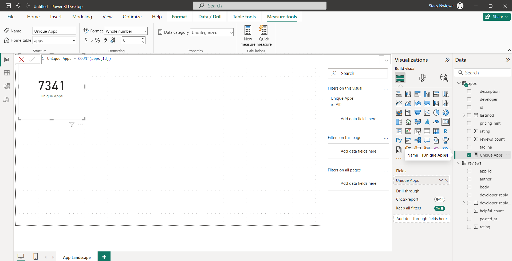
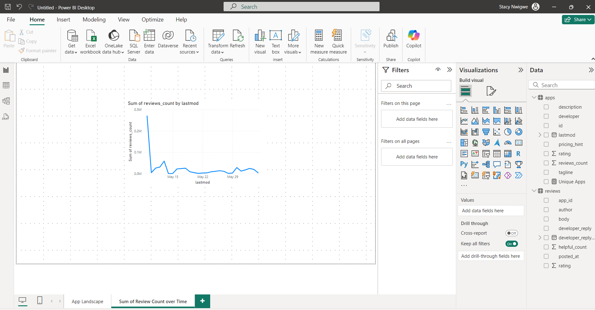
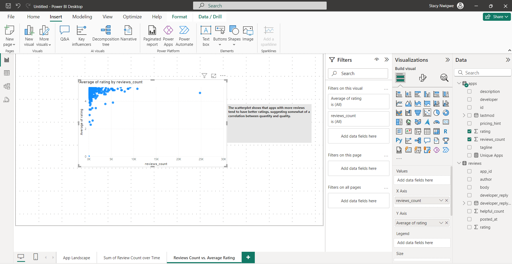
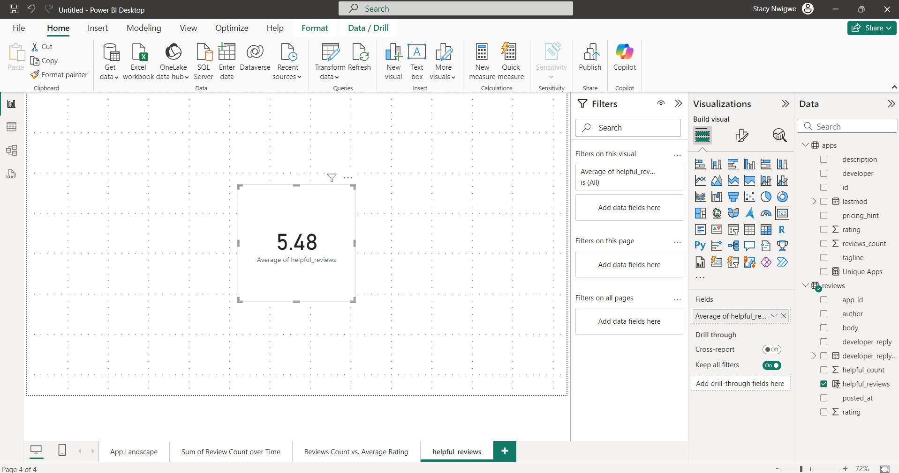
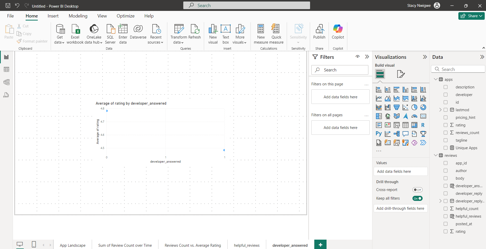
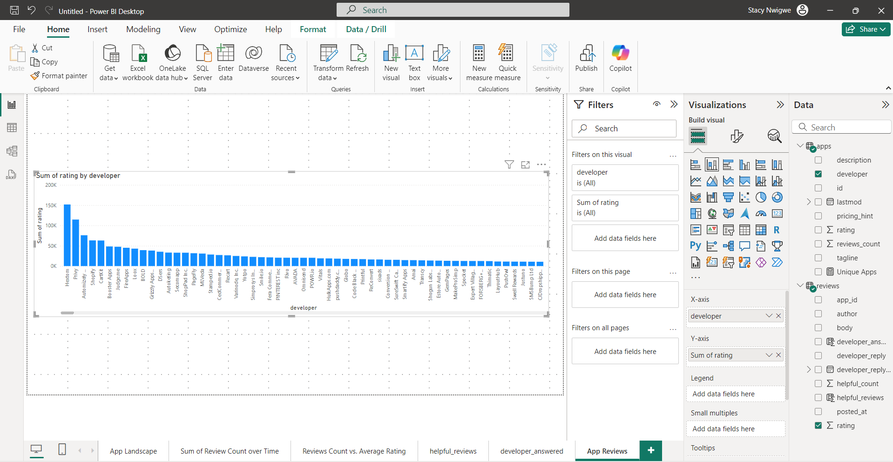
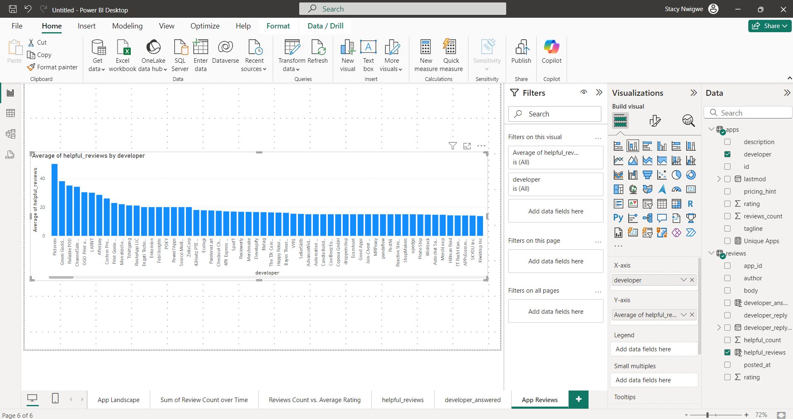
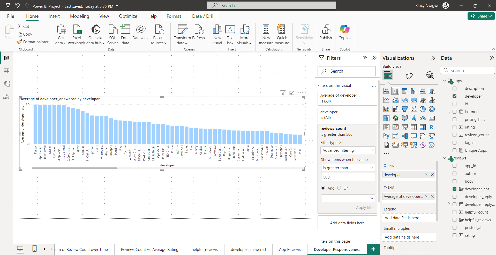

[🔙 Back to Portfolio](https://stacynwigwe.github.io/portfolio/)
---
🔙 **Return to [Main Data Projects Hub](https://stacynwigwe.github.io/portfolio/projects/)** 

---

# Shopify App Store Analysis  
*Power BI Dashboard & Insights Report*

## Overview  
This project analyzes **Shopify App Store performance**, focusing on user engagement, ratings, developer responsiveness, and review behavior.  
The goal is to identify what drives successful apps in the Shopify ecosystem.

---

## Objectives  
- Explore the landscape of available Shopify apps  
- Analyze review trends and rating distributions  
- Evaluate developer responsiveness  
- Identify patterns that contribute to app quality and visibility  

---
## Dashboard Screenshots

Here are the key visuals from the Power BI Shopify App Analysis

### 1. KPI – Unique Apps Count

_Screenshot shows a KPI visual displaying the total number of unique apps on the Shopify App Store._

### 2. Line Chart – Reviews Over Time

_Screenshot displays a line chart showing the sum of reviews over time (based on the `lastmod` date), illustrating the review trends across apps._

### 3. Scatterplot – Review Count vs Average Rating

_Screenshot shows a scatterplot analyzing the relationship between the number of reviews and the average app rating, highlighting how app popularity correlates with user feedback._

### 4. KPI – Helpful Reviews Score

_Screenshot presents a KPI card with the calculated column `helpful_reviews`, which multiplies rating by 1+helpful_count to emphasize the importance of helpful feedback._

### 5. Scatterplot – Developer Responsiveness

_Screenshot showcases a scatterplot comparing average app ratings with developer responsiveness (based on whether a developer replied to user reviews)._

### 6. Bar Chart – Developer Quality

_Screenshot shows a bar chart illustrating the sum of app ratings for each developer, providing insight into overall performance._

### 7. Bar Chart – Responsiveness Compared

_Screenshot displays a bar chart that emphasizes the average helpful review score by developer, offering a more nuanced view of app quality._

### 8. Bar Chart – Developer Performance (Filtered)

_Screenshot presents a bar chart analyzing developer responsiveness, filtered to show only apps with more than 500 reviews._

---

## Files Included  
- 8 dashboard screenshots  
- README  

---

## Key Insights  
- Top-performing Shopify apps consistently maintain high review volumes combined with stable ratings.  
- Developer responsiveness strongly correlates with higher user satisfaction and review helpfulness.  
- Apps with consistent updates and quick developer replies tend to outperform competitors in visibility and trust.

---

## Tools Used  
- Power BI  
- Power Query  
- DAX  
- GitHub  
- Excel  

---

## Conclusion  
This analysis reveals how **user engagement, developer activity, and review quality** shape the success of Shopify apps.  
These insights can guide app developers in optimizing user experience and improving product quality.
