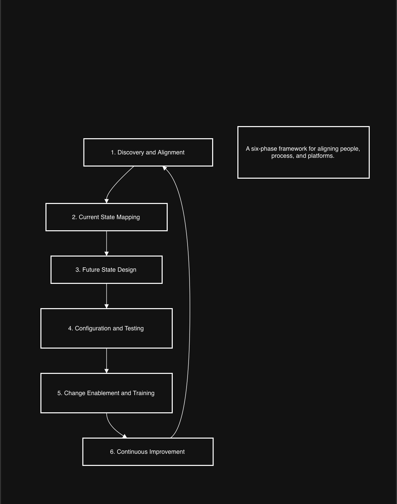
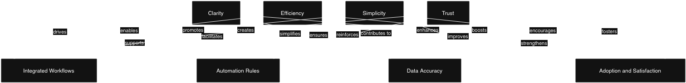

[🔙 Back to Portfolio](https://stacynwigwe.github.io/portfolio/)
---
🔙 **Return to [Main Data Projects Hub](https://stacynwigwe.github.io/portfolio/projects/)**  

# System Implementation Framework: Translating User Needs into Technology

## Project Overview
This case study illustrates my approach to bridging the gap between technical systems and user adoption across enterprise environments. Drawing from real world experiences in Student Information Systems and Portfolio and Project Management platforms, I developed a repeatable framework that aligns user needs, workflows, and data integrity.

The framework shows how complex implementations can become intuitive, human centered systems that enhance efficiency and engagement.

## The Challenge
Many system implementations fail not because the technology is flawed but because users do not feel supported in how the system serves daily work. Inconsistent processes, unclear ownership, and limited training introduce friction that slows adoption.

This project explores a practical approach that ensures
* user needs drive configuration decisions
* workflows are mapped and simplified before automation
* change enablement is built into the rollout

## The Framework

### 1. Discovery and Alignment
* Conduct stakeholder interviews to surface pain points and business requirements  
* Clarify overlaps between departments and decision ownership  
* Define success metrics for efficiency, accuracy, and user satisfaction

### 2. Current State Mapping
* Document existing workflows to reveal redundancies and bottlenecks  
* Create process maps that make data handoffs and manual steps visible

### 3. Future State Design
* Design optimized workflows aligned with technology capabilities and organizational goals  
* Draft user stories and swimlane diagrams that connect user experience to system logic

### 4. Configuration and Testing
* Partner with IT and vendors to configure modules and automations based on validated requirements  
* Create and run test cases that mirror real scenarios, including exception paths  
* Validate data quality and migration rules

### 5. Change Enablement and Training
* Create quick reference guides, annotated walkthroughs, and short demo clips  
* Establish feedback loops during pilot phases to surface early friction  
* Adjust training based on adoption signals and help desk patterns

### 6. Continuous Improvement
* Monitor performance metrics and qualitative feedback after launch  
* Host recurring system health reviews to refine processes and sustain adoption

## Outcome
This framework has been used to
* reduce configuration errors through clearer requirement alignment  
* improve user satisfaction during pilot rollouts  
* create a reusable blueprint for future deployments in SIS and PPM contexts

By combining structured analysis with empathetic communication, teams gain confidence, clarity, and momentum. The result is a system that supports real work and earns user trust.

## Visual Concepts

### Visual 1: System Implementation Lifecycle

_A single diagram that displays the six stages as a loop_

---

### Visual 2: Translating Human Needs into Digital Systems

*A two column relationship map that shows how user needs connect to system outcomes*

